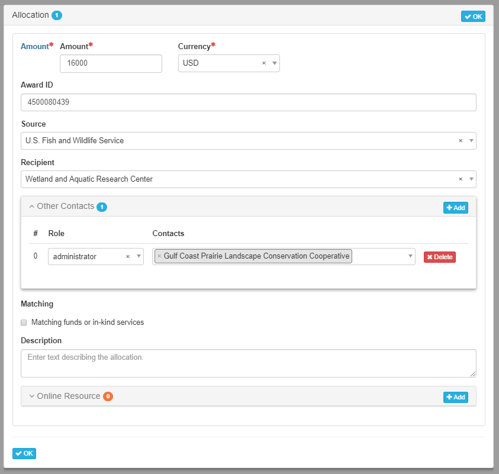

# Funding Tab: Project

Tracking funding in the metadata allows for identification of funding sources, comparison, and aggregation across all LCCs.

| **Quick Reference: Project Funding Tab** | Required? |
| :--- | :--- |
| Allocation, including Award ID, Amount, Source, Recipient | Required |
| Funding Administrator | \*New Required Metadata Improvement |
| Matching Funds, including Amount, Source, Recipient | Best Practice |
| Time Period \(fiscal year of allocation\) | Required |

## Funding Allocations

Allocations describe where project funding came from, where and when it was distributed, and amounts. Science Catalog users can search by specific fiscal year, funders, or recipients.

A funding allocation represents a single fiscal year, source, and recipient.


If you have two recipients in a single fiscal year, they need to be added as separate funding allocations.


### Required Fields

For each funding allocation, the following fields should be filled out.

#### Award ID \(Required if one exists\)

You are required to include Award ID numbers if they exist for your project. Award IDs include grant or cooperative agreement numbers, contract numbers, or inter-agency agreement numbers. Inclusion of Award IDs provides accountability and allows tracking and auditing between financial systems and the Science Catalog.

#### Amount \(Required\)

Enter the amount of funding.

#### Source \(Required\)

Add the relevant contact for the “source” of the project funding. Source should be an organization, not an individual. For LCC projects, the most common sources are U.S. Fish and Wildlife Service, Bureau of Land Management, and Bureau of Reclamation. LCCs should be added as the funding "administrator" in the Other Contacts field.


Funding source should always identify the agency or organization, rather than a sub-program or office. For example, all funding from other FWS programs need to list U.S. Fish and Wildlife Service as the source \(and not list the source as Fisheries, specific Refuges, ES, etc.\). Clarifications on the exact program or office where the funding came from can be done through the Funding/Other Contacts field \(and choose the role of "administrator"\).


#### Recipient \(Required\)

Add the relevant contact for the “recipient” of the project funding. Recipient should always be an organization, not an individual. For example, the Principal Investigator would not be listed as the recipient, but their organization would be. If there are multiple recipients for a project, they need to be added as separate allocations.

You could add the Principal Investigator in the Other Contacts field as "principalInvestigator."

#### Other Contacts \(\*New Required Metadata Improvement\)

Add the LCC as the funding "administrator" for all LCC allocations. The funding source should identify the agency who supplied the funding.


Funding administrator can also be used to differentiate funding from different programs/offices within the same agency. For example, the U.S. Fish and Wildlife Service can be identified as the funding source and the funding administrator could include "Ecological Services" or a specific field office.


#### Matching and In-kind Funds

Project funds or in-kind support that were supplied by a partner \(i.e., not specifically allocated to an LCC\) should be included as an allocation with the matching fund box checked. Each matching fund provider needs to be included as a separate allocation.

## Time Period

### Dates \(Required\)

For each allocation, enter the fiscal year that funds were awarded \(not the time span of the entire project\). There should be a single fiscal year for each allocation. Adding a time period lets users know when your items were funded, and lets them find your item when searching for items funded in a similar time period.


Use the “Pick a Fiscal Year” dropdown to autofill the date fields.


Example of multiple allocations for a single project record.

