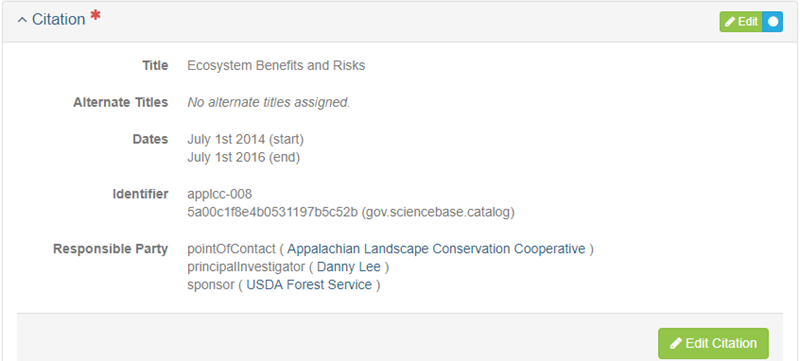

# Main Tab: Project

The **Main** tab allows for the creation and/or editing of primary metadata.

| Quick Reference: Project Main Tab | Required? |
| :--- | :--- |
| Basic Information: Title, Status | Required |
| Resource Type | Required |
| Point of Contact | Required |
| Citation: Dates, Responsible Parties, Online Resource, Identifier | Required |
| Description: Abstract | Required |
| Time Period | Required |

## Basic Information

### Record ID

Record ID will be auto-generated. It can be edited but it should only be edited if absolutely necessary \(and ideally edited as soon as the record is created in mdEditor\).

### Title \(Required\)

Enter as informative a title as possible. Good titles, when they appear in a search, will be understood and/or traceable.

### Status \(Required\)

The **Status** drop-down menu allows you to select the status of your project. Choose status ONLY from the four following options: _completed, ongoing, proposed, or accepted._

## Default Locale

**Default Locale** allows for the selection of **Language**, **Character Set**, and **Country**. English, UTF-8, and USA will be selected by default, but you may change them if necessary.

## Resource Types \(Required\)

For projects, the Resource Type should be automatically filled in with the resource type you selected when you created your record. This should be "project" for all LCC projects. Name is optional - you can leave this blank.

## Point of Contacts

Adding a point of contact gives users information on who to contact should they have a question regarding your project or product.


To add contacts to a metadata record, you must first create/upload the contacts into mdEditor. See the [Contact](https://github.com/tpatterson1996/lcc-metadata-manual/tree/287090b07635d0e76a714278ce1f6c4aac3594cc/product-entry-guidance/contact-entry-guidance.md) Section for more information.


### Contacts

| Role | Contact | Required? |
| :--- | :--- | :--- |
| pointOfContact | LCC Network Data Steward | Required |
| pointOfContact | Your LCC | NOT Required \(\*see below\) |
| principalInvestigator | The Project PI | Best Practice |

\*Note: Given the transition away from LCCs, it is no longer required to add the LCC as a Main / Point of Contact in new or updated metadata records.


The LCC Network Data Steward will serve as the long term contact/backup. This way, users have a point-of-contact even if there is a positional change within an organization. The LCC Network Data Steward should be included in addition to any point of contact that you want to add from your organization.


## Citation

**The Citation** describes pertinent information about your project such as: responsible parties, internal and ScienceBase identifiers, and any online resources that may relate to your item. Adding information in the citation will also improve users' ability to find your items.

### Citation Required Fields

#### Title \(Required\)

The citation title is automatically populated with the title of your record.

#### Alternate Title \(Optional\)

You can add an alternate title if desired - generally these should be shorter than the full Title.

#### Dates \(Optional\)

Enter _acquisition, creation, revision,_ or another date reference from the picklist and then enter the date.

#### Responsible Parties \(Required\)

Responsible parties must include a point of contact, but may also include other responsible parties such as funders \(including your LCC\), partners, collaborators, and contributors. Collaborators could be intellectual participants while contributors could be intellectual and financial participants.


To add contacts to a metadata record, you must first create/upload the contacts in mdEditor. See the [Contacts](../contacts/) section for more information.


| Role | Contact | Required? |
| :--- | :--- | :--- |
| pointofContact | LCC Network Data Steward | Required |
| administrator | Your LCC | Required |
| principalInvestigator | The Project PI | Best Practice |

#### Online Resource \(Required, if available\)

Enter the Name and URL for the project homepage on your LCC website.

#### Identifier \(Best Practice\)

You may enter as many identifiers as desired. If you have internal LCC-specific IDs for projects, enter them here. Other optional identifiers for projects include: Archive Folder Name.


**Best Practice**: Create and use internal identifiers that are unique within your LCC for projects and their products. Example: GNLCC2010-11.



If your item does not have a ScienceBase ID yet, ScienceBase will create one automatically upon publishing. If you imported your item from ScienceBase originally, then the SBID will already be included in Metadata/Metadata Identifier and you do not need to include it here. Note that if you edit an item that is already on ScienceBase without using its existing ID, a duplicate item will be created on ScienceBase. Consult the [Publish](../publish/) section of this manual to learn more.


#### 

## Description

**Description** allows for the addition of the **Abstract** as well as a Short Abstract, and Supplemental Information.

### Abstract \(Required\)

Enter an abstract that succinctly describes the project's purpose and goals. Include key species or habitats as well.


Tip: Write your project abstract in the present tense if the project is in progress and past tense if the project has been completed.


### Short Abstract \(Optional\)

Enter a short description, limited to 300 characters, if desired.

### Supplemental Information \(Optional\)

Enter comments, if desired.

## Time Period

**Time Period** refers to project start and end date.


This set of dates is distinct from the fiscal year of funding. Here you want to indicate the overall project start and end dates. In the Funding section you will specify the fiscal years that funds were allocated.


### Dates \(Required\)

For each project, add a Start Date and End Date. If the project spanned a single fiscal year, you can use the “Pick a Fiscal Year” dropdown to autofill the date fields.

